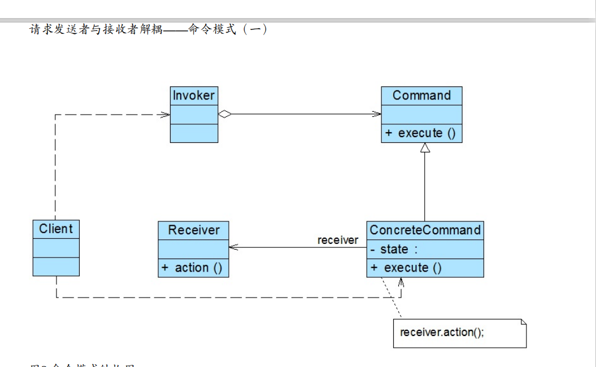
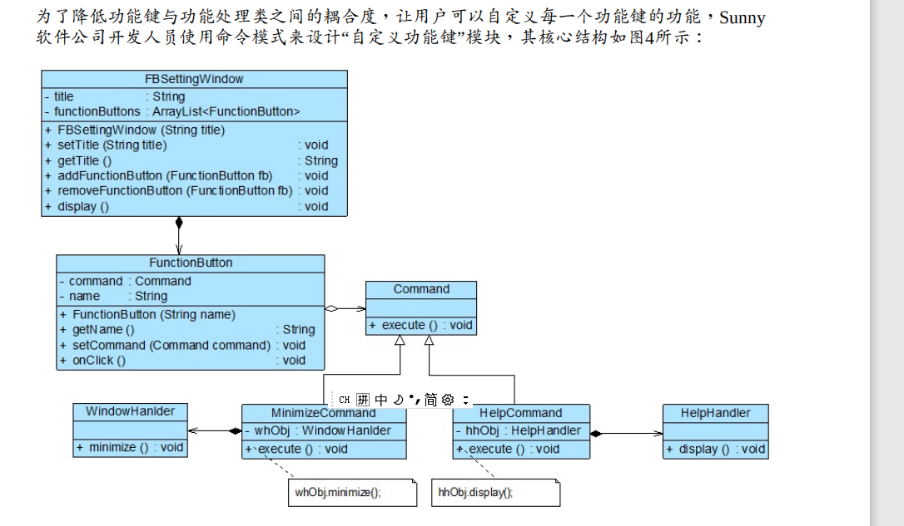
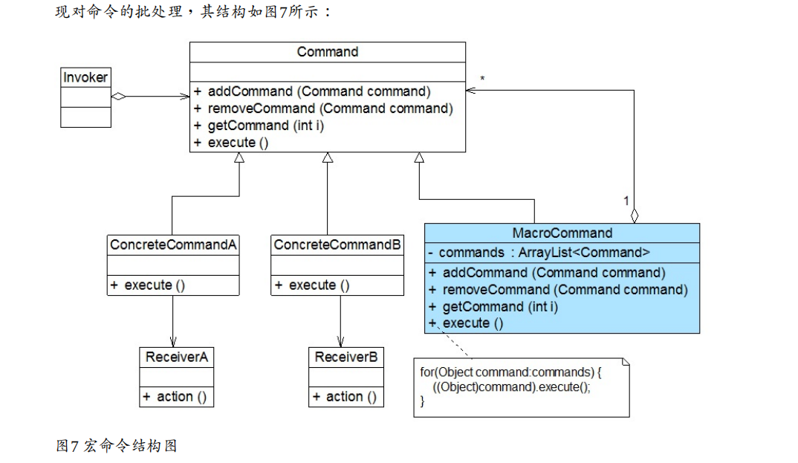

# 命令模式

## 命令模式概述

命令模式(Command Pattern)：将一个请求封装为一个对象，从而让我们可用不同的请求对客户 

进行参数化；对请求排队或者记录请求日志，以及支持可撤销的操作。命令模式是一种对象 

行为型模式，其别名为动作(Action)模式或事务(Transaction)模式。 

##　几个角色

● Command（抽象命令类）：抽象命令类一般是一个抽象类或接口，在其中声明了用于执行 

请求的execute()等方法，通过这些方法可以调用请求接收者的相关操作。 

● ConcreteCommand（具体命令类）：具体命令类是抽象命令类的子类，实现了在抽象命令类 

中声明的方法，它对应具体的接收者对象，将接收者对象的动作绑定其中。在实现execute()方 

法时，将调用接收者对象的相关操作(Action)。 

● Invoker（调用者）：调用者即请求发送者，它通过命令对象来执行请求。一个调用者并不 

需要在设计时确定其接收者，因此它只与抽象命令类之间存在关联关系。在程序运行时可以 

将一个具体命令对象注入其中，再调用具体命令对象的execute()方法，从而实现间接调用请求 

接收者的相关操作。 

● Receiver（接收者）：接收者执行与请求相关的操作，它具体实现对请求的业务处理。

命令模式的本质是对请求进行封装，一个请求对应于一个命令，将发出命令的责任和执行命 

令的责任分割开。每一个命令都是一个操作：

## 实例图

###　撤销操作的实现 

在命令模式中，我们可以通过调用一个命令对象的execute()方法来实现对请求的处理，如果需 

要撤销(Undo)请求，可通过在命令类中增加一个逆向操作来实现。 

扩展

除了通过一个逆向操作来实现撤销(Undo)外，还可以通过保存对象的历史状态来实现撤销，后 

者可使用备忘录模式(Memento Pattern)来实现。 

# 宏命令 

宏命令(Macro Command)又称为组合命令，它是组合模式和命令模式联用的产物。

# 命令模式总结

## 1. 主要优点 

命令模式的主要优点如下： 

(1) 降低系统的耦合度。由于请求者与接收者之间不存在直接引用，因此请求者与接收者之间 

实现完全解耦，相同的请求者可以对应不同的接收者，同样，相同的接收者也可以供不同的 

请求者使用，两者之间具有良好的独立性。 

(2) 新的命令可以很容易地加入到系统中。由于增加新的具体命令类不会影响到其他类，因此 增加新的具体命令类很容易，无须修改原有系统源代码，甚至客户类代码，满足“开闭原则”的 

要求。 

(3) 可以比较容易地设计一个命令队列或宏命令（组合命令）。 

(4) 为请求的撤销(Undo)和恢复(Redo)操作提供了一种设计和实现方案。 

## 主要缺点 

命令模式的主要缺点如下： 

使用命令模式可能会导致某些系统有过多的具体命令类。因为针对每一个对请求接收者的调 

用操作都需要设计一个具体命令类，因此在某些系统中可能需要提供大量的具体命令类，这 

将影响命令模式的使用。 

##  适用场景 

在以下情况下可以考虑使用命令模式： 

(1) 系统需要将请求调用者和请求接收者解耦，使得调用者和接收者不直接交互。请求调用者 

无须知道接收者的存在，也无须知道接收者是谁，接收者也无须关心何时被调用。 

(2) 系统需要在不同的时间指定请求、将请求排队和执行请求。一个命令对象和请求的初始调 

用者可以有不同的生命期，换言之，最初的请求发出者可能已经不在了，而命令对象本身仍 

然是活动的，可以通过该命令对象去调用请求接收者，而无须关心请求调用者的存在性，可 

以通过请求日志文件等机制来具体实现。 

(3) 系统需要支持命令的撤销(Undo)操作和恢复(Redo)操作。 

(4) 系统需要将一组操作组合在一起形成宏命令。 