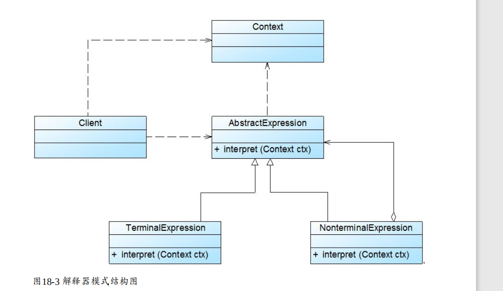
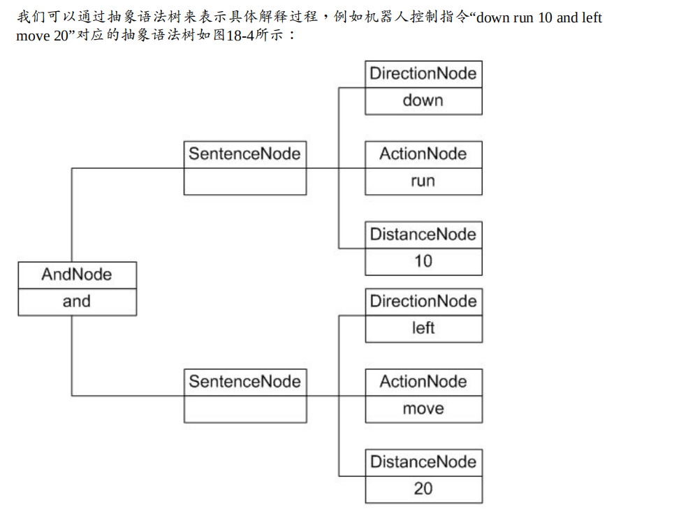
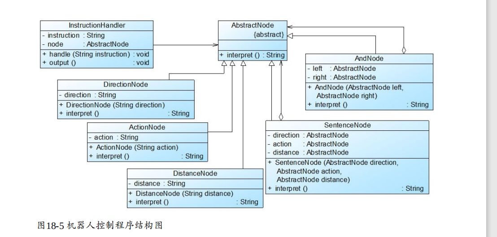

# 解释器模式概述 

解释器模式定义如下： 解释器模式(Interpreter Pattern)：定义一个语言的文法，并且建立一个 

解释器来解释该语言中的句子，这里的“语言”是指使用规定格式和语法的代码。解释器模式是 

一种类行为型模式。 

## 几个角色：

● AbstractExpression（抽象表达式）：在抽象表达式中声明了抽象的解释操作，它是所有终结 

符表达式和非终结符表达式的公共父类。 

● TerminalExpression（终结符表达式）：终结符表达式是抽象表达式的子类，它实现了与文法 

中的终结符相关联的解释操作，在句子中的每一个终结符都是该类的一个实例。通常在一个 

解释器模式中只有少数几个终结符表达式类，它们的实例可以通过非终结符表达式组成较为 

复杂的句子。 

● NonterminalExpression（非终结符表达式）：非终结符表达式也是抽象表达式的子类，它实 

现了文法中非终结符的解释操作，由于在非终结符表达式中可以包含终结符表达式，也可以 

继续包含非终结符表达式，因此其解释操作一般通过递归的方式来完成。 

● Context（环境类）：环境类又称为上下文类，它用于存储解释器之外的一些全局信息，通 

常它临时存储了需要解释的语句。 

# 实例抽象图

## 解释器模式总结 

###  主要优点 

解释器模式的主要优点如下： 

(1) 易于改变和扩展文法。由于在解释器模式中使用类来表示语言的文法规则，因此可以通过 

继承等机制来改变或扩展文法。 

(2) 每一条文法规则都可以表示为一个类，因此可以方便地实现一个简单的语言。 

(3) 实现文法较为容易。在抽象语法树中每一个表达式节点类的实现方式都是相似的，这些类 

的代码编写都不会特别复杂，还可以通过一些工具自动生成节点类代码。 

(4) 增加新的解释表达式较为方便。如果用户需要增加新的解释表达式只需要对应增加一个新 

的终结符表达式或非终结符表达式类，原有表达式类代码无须修改，符合“开闭原则”。 

###  主要缺点 

解释器模式的主要缺点如下： 

(1) 对于复杂文法难以维护。在解释器模式中，每一条规则至少需要定义一个类，因此如果一 

个语言包含太多文法规则，类的个数将会急剧增加，导致系统难以管理和维护，此时可以考 

虑使用语法分析程序等方式来取代解释器模式。 

(2) 执行效率较低。由于在解释器模式中使用了大量的循环和递归调用，因此在解释较为复杂 

的句子时其速度很慢，而且代码的调试过程也比较麻烦。 

###  适用场景 

在以下情况下可以考虑使用解释器模式： 

(1) 可以将一个需要解释执行的语言中的句子表示为一个抽象语法树。 

(2) 一些重复出现的问题可以用一种简单的语言来进行表达。 

(3) 一个语言的文法较为简单。 

(4) 执行效率不是关键问题。【注：高效的解释器通常不是通过直接解释抽象语法树来实现 

的，而是需要将它们转换成其他形式，使用解释器模式的执行效率并不高。】 