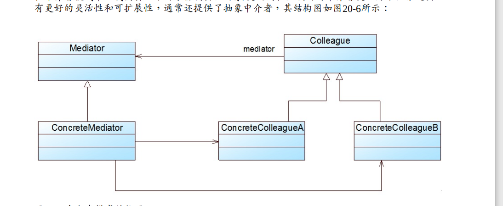
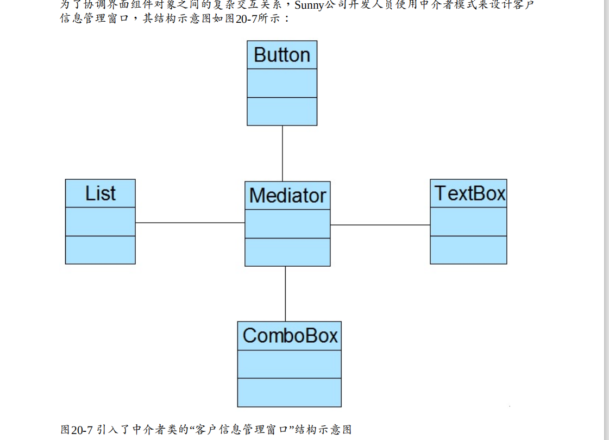
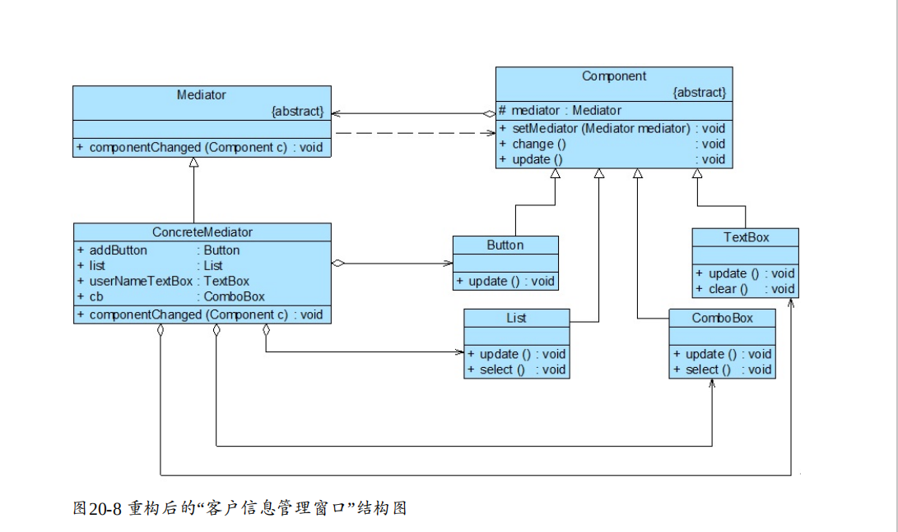

# 中介者模式

中介者模式定义如下： 

中介者模式(Mediator Pattern)：用一个中介对象（中介者）来封装一系列的对象交互，中 

介者使各对象不需要显式地相互引用，从而使其耦合松散，而且可以独立地改变它们之 

间的交互。中介者模式又称为调停者模式，它是一种对象行为型模式。 

## 角色

● Mediator（抽象中介者）：它定义一个接口，该接口用于与各同事对象之间进行通信。 

● ConcreteMediator（具体中介者）：它是抽象中介者的子类，通过协调各个同事对象来实现 

协作行为，它维持了对各个同事对象的引用。 

● Colleague（抽象同事类）：它定义各个同事类公有的方法，并声明了一些抽象方法来供子类 

实现，同时它维持了一个对抽象中介者类的引用，其子类可以通过该引用来与中介者通信。 

● ConcreteColleague（具体同事类）：它是抽象同事类的子类；每一个同事对象在需要和其他 

同事对象通信时，先与中介者通信，通过中介者来间接完成与其他同事类的通信；在具体同 

事类中实现了在抽象同事类中声明的抽象方法。 

## 实例结构图

## 中介者模式总结 

### 主要优点 

中介者模式的主要优点如下： 

(1) 中介者模式简化了对象之间的交互，它用中介者和同事的一对多交互代替了原来同事之间 

的多对多交互，一对多关系更容易理解、维护和扩展，将原本难以理解的网状结构转换成相 

对简单的星型结构。 

(2) 中介者模式可将各同事对象解耦。中介者有利于各同事之间的松耦合，我们可以独立的改 

变和复用每一个同事和中介者，增加新的中介者和新的同事类都比较方便，更好地符合“开闭 

原则”。 

(3) 可以减少子类生成，中介者将原本分布于多个对象间的行为集中在一起，改变这些行为只 

需生成新的中介者子类即可，这使各个同事类可被重用，无须对同事类进行扩展。 

### 主要缺点 

中介者模式的主要缺点如下： 

在具体中介者类中包含了大量同事之间的交互细节，可能会导致具体中介者类非常复杂，使 

得系统难以维护。 

###  适用场景 

在以下情况下可以考虑使用中介者模式： 

(1) 系统中对象之间存在复杂的引用关系，系统结构混乱且难以理解。 

(2) 一个对象由于引用了其他很多对象并且直接和这些对象通信，导致难以复用该对象。 

(3) 想通过一个中间类来封装多个类中的行为，而又不想生成太多的子类。可以通过引入中介 

者类来实现，在中介者中定义对象交互的公共行为，如果需要改变行为则可以增加新的具体 

中介者类

# 自己理解
一个抽象中介者类(意味可以有多个中介者),一个抽象同事类(protect保持对抽象中介者类的引用),具体同事类会转发请求到具体中介者类
,再根据具体中介者进行处理