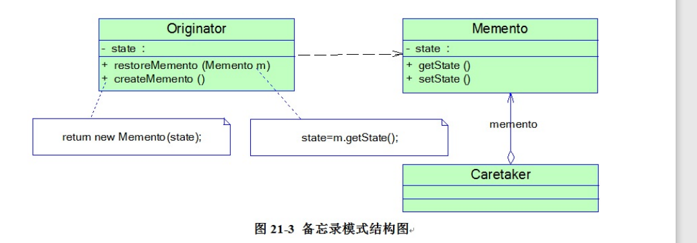
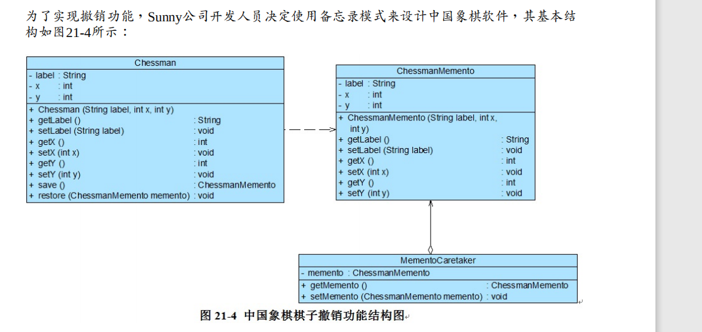

 

# 备忘录模式概述 

备忘录模式定义如下： 

备忘录模式(Memento Pattern)：在不破坏封装的前提下，捕获一个对象的内部状态，并在 

该对象之外保存这个状态，这样可以在以后将对象恢复到原先保存的状态。它是一种对 

象行为型模式，其别名为Token。 

## 角色

● Originator（原发器）：它是一个普通类，可以创建一个备忘录，并存储它的当前内部状 

态，也可以使用备忘录来恢复其内部状态，一般将需要保存内部状态的类设计为原发器。 

●Memento（备忘录)：存储原发器的内部状态，根据原发器来决定保存哪些内部状态。备忘录 

的设计一般可以参考原发器的设计，根据实际需要确定备忘录类中的属性。需要注意的是， 

除了原发器本身与负责人类之外，备忘录对象不能直接供其他类使用，原发器的设计在不同 

的编程语言中实现机制会有所不同。 

●Caretaker（负责人）：负责人又称为管理者，它负责保存备忘录，但是不能对备忘录的内容 

进行操作或检查。在负责人类中可以存储一个或多个备忘录对象，它只负责存储对象，而不 

能修改对象，也无须知道对象的实现细节。 

# 实例

## 备忘录模式总结

### 主要优点 

备忘录模式的主要优点如下： 

(1)它提供了一种状态恢复的实现机制，使得用户可以方便地回到一个特定的历史步骤，当新 

的状态无效或者存在问题时，可以使用暂时存储起来的备忘录将状态复原。 

(2)备忘录实现了对信息的封装，一个备忘录对象是一种原发器对象状态的表示，不会被其他 

代码所改动。备忘录保存了原发器的状态，采用列表、堆栈等集合来存储备忘录对象可以实 

现多次撤销操作。 

### 主要缺点 

备忘录模式的主要缺点如下： 

资源消耗过大，如果需要保存的原发器类的成员变量太多，就不可避免需要占用大量的存储 

空间，每保存一次对象的状态都需要消耗一定的系统资源。 

### 适用场景 

在以下情况下可以考虑使用备忘录模式： 

(1)保存一个对象在某一个时刻的全部状态或部分状态，这样以后需要时它能够恢复到先前的 

状态，实现撤销操作。 

(2)防止外界对象破坏一个对象历史状态的封装性，避免将对象历史状态的实现细节暴露给外 

界对象