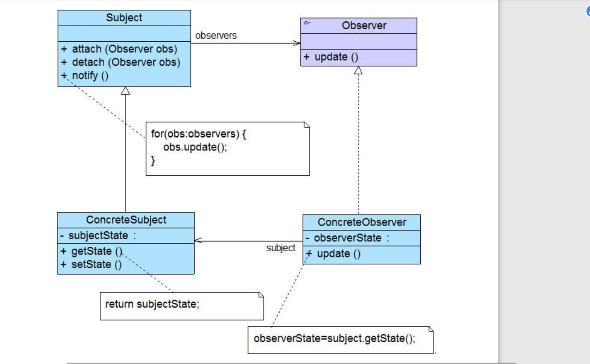

# 观察者模式概述

观察者模式定义如下： 观察者模式(Observer Pattern)：定义对象之间的一种一对多依赖关系， 

使得每当一个对象状态发生改变时，其相关依赖对象皆得到通知并被自动更新。观察者模式 

的别名包括发布-订阅（Publish/Subscribe）模式、模型-视图（Model/View）模式、源-监听器 

（Source/Listener）模式或从属者（Dependents）模式。观察者模式是一种对象行为型模式。

## 几个角色

● Subject（目标）：目标又称为主题，它是指被观察的对象。在目标中定义了一个观察者集 

合，一个观察目标可以接受任意数量的观察者来观察，它提供一系列方法来增加和删除观察 

者对象，同时它定义了通知方法notify()。目标类可以是接口，也可以是抽象类或具体类。 

● ConcreteSubject（具体目标）：具体目标是目标类的子类，通常它包含有经常发生改变的数 

据，当它的状态发生改变时，向它的各个观察者发出通知；同时它还实现了在目标类中定义 

的抽象业务逻辑方法（如果有的话）。如果无须扩展目标类，则具体目标类可以省略。 

● Observer（观察者）：观察者将对观察目标的改变做出反应，观察者一般定义为接口，该接 

口声明了更新数据的方法update()，因此又称为抽象观察者。 

● ConcreteObserver（具体观察者）：在具体观察者中维护一个指向具体目标对象的引用，它 

存储具体观察者的有关状态，这些状态需要和具体目标的状态保持一致；它实现了在抽象观 

察者Observer中定义的update()方法。通常在实现时，可以调用具体目标类的attach()方法将自 

己添加到目标类的集合中或通过detach()方法将自己从目标类的集合中删除。 

## 实例

## 观察者模式总结 

### 1.主要优点 

观察者模式的主要优点如下： 

(1) 观察者模式可以实现表示层和数据逻辑层的分离，定义了稳定的消息更新传递机制，并抽 

象了更新接口，使得可以有各种各样不同的表示层充当具体观察者角色。 

(2) 观察者模式在观察目标和观察者之间建立一个抽象的耦合。观察目标只需要维持一个抽象 

观察者的集合，无须了解其具体观察者。由于观察目标和观察者没有紧密地耦合在一起，因 

此它们可以属于不同的抽象化层次。 

(3) 观察者模式支持广播通信，观察目标会向所有已注册的观察者对象发送通知，简化了一对 

多系统设计的难度。 

(4) 观察者模式满足“开闭原则”的要求，增加新的具体观察者无须修改原有系统代码，在具体 

观察者与观察目标之间不存在关联关系的情况下，增加新的观察目标也很方便。 

### 2.主要缺点 

观察者模式的主要缺点如下： 

(1) 如果一个观察目标对象有很多直接和间接观察者，将所有的观察者都通知到会花费很多时 

间。

(2) 如果在观察者和观察目标之间存在循环依赖，观察目标会触发它们之间进行循环调用，可 

能导致系统崩溃。 

(3) 观察者模式没有相应的机制让观察者知道所观察的目标对象是怎么发生变化的，而仅仅只 

是知道观察目标发生了变化。 

### 3.适用场景 

在以下情况下可以考虑使用观察者模式： 

(1) 一个抽象模型有两个方面，其中一个方面依赖于另一个方面，将这两个方面封装在独立的 

对象中使它们可以各自独立地改变和复用。 

(2) 一个对象的改变将导致一个或多个其他对象也发生改变，而并不知道具体有多少对象将发 

生改变，也不知道这些对象是谁。 

(3) 需要在系统中创建一个触发链，A对象的行为将影响B对象，B对象的行为将影响C对 

象……，可以使用观察者模式创建一种链式触发机制。 

 #自己理解
 一个抽象的观察者类,意味着可以有多个观察者,然后是被观察者实体的各种行为通知具体观察者,可以将通知观察者的行为封装到一个接口当中,被观察
 者实现这个接口就行