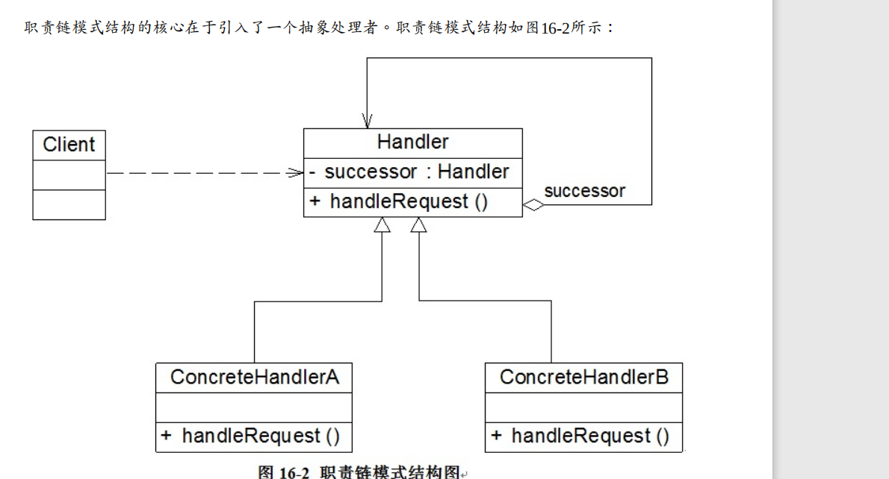
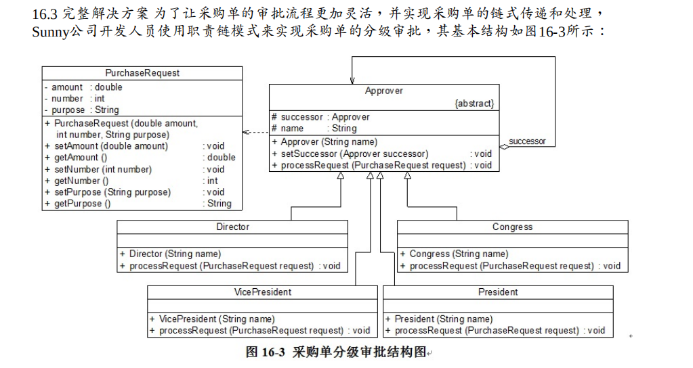

# 职责链模式概述 

职责链模式定义如下： 职责链模式(Chain of Responsibility Pattern)：避免请求发送者与接收者 

耦合在一起，让多个对象都有可能接收请求，将这些对象连接成一条链，并且沿着这条链传 

递请求，直到有对象处理它为止。职责链模式是一种对象行为型模式。 

##　几个角色

● Handler（抽象处理者）：它定义了一个处理请求的接口，一般设计为抽象类，由于不同的 

具体处理者处理请求的方式不同，因此在其中定义了抽象请求处理方法。因为每一个处理者 

的下家还是一个处理者，因此在抽象处理者中定义了一个抽象处理者类型的对象（如结构图 

中的successor），作为其对下家的引用。通过该引用，处理者可以连成一条链。 

● ConcreteHandler（具体处理者）：它是抽象处理者的子类，可以处理用户请求，在具体处理 

者类中实现了抽象处理者中定义的抽象请求处理方法，在处理请求之前需要进行判断，看是 

否有相应的处理权限，如果可以处理请求就处理它，否则将请求转发给后继者；在具体处理 

者中可以访问链中下一个对象，以便请求的转发。

# 实例概念图

## 纯与不纯的职责链模式

### (1) 纯的职责链模式 

一个纯的职责链模式要求一个具体处理者对象只能在两个行为中选择一个：要么承担全部责 

任，要么将责任推给下家，不允许出现某一个具体处理者对象在承担了一部分或全部责任后 

又将责任向下传递的情况。而且在纯的职责链模式中，要求一个请求必须被某一个处理者对 

象所接收，不能出现某个请求未被任何一个处理者对象处理的情况。在前面的采购单审批实 

例中应用的是纯的职责链模式。 

### (2)不纯的职责链模式 

在一个不纯的职责链模式中允许某个请求被一个具体处理者部分处理后再向下传递，或者一 

个具体处理者处理完某请求后其后继处理者可以继续处理该请求，而且一个请求可以最终不 

被任何处理者对象所接收。

# 职责链模式总结

职责链模式通过建立一条链来组织请求的处理者，请求将沿着链进行传递，请求发送者无须 

知道请求在何时、何处以及如何被处理，实现了请求发送者与处理者的解耦。在软件开发 

中，如果遇到有多个对象可以处理同一请求时可以应用职责链模式，例如在Web应用开发中创 

建一个过滤器(Filter)链来对请求数据进行过滤，在工作流系统中实现公文的分级审批等等，使 

用职责链模式可以较好地解决此类问题。 

## 1.主要优点 

职责链模式的主要优点如下： 

(1) 职责链模式使得一个对象无须知道是其他哪一个对象处理其请求，对象仅需知道该请求会 

被处理即可，接收者和发送者都没有对方的明确信息，且链中的对象不需要知道链的结构， 

由客户端负责链的创建，降低了系统的耦合度。 

(2) 请求处理对象仅需维持一个指向其后继者的引用，而不需要维持它对所有的候选处理者的 

引用，可简化对象的相互连接。 

(3) 在给对象分派职责时，职责链可以给我们更多的灵活性，可以通过在运行时对该链进行动 

态的增加或修改来增加或改变处理一个请求的职责。 

(4) 在系统中增加一个新的具体请求处理者时无须修改原有系统的代码，只需要在客户端重新 

建链即可，从这一点来看是符合“开闭原则”的。 

## 2.主要缺点 

职责链模式的主要缺点如下： 

(1) 由于一个请求没有明确的接收者，那么就不能保证它一定会被处理，该请求可能一直到链 

的末端都得不到处理；一个请求也可能因职责链没有被正确配置而得不到处理。 

(2) 对于比较长的职责链，请求的处理可能涉及到多个处理对象，系统性能将受到一定影响， 

而且在进行代码调试时不太方便。 

(3) 如果建链不当，可能会造成循环调用，将导致系统陷入死循环。 

## 3.适用场景 

在以下情况下可以考虑使用职责链模式： 

(1) 有多个对象可以处理同一个请求，具体哪个对象处理该请求待运行时刻再确定，客户端只 

需将请求提交到链上，而无须关心请求的处理对象是谁以及它是如何处理的。 

(2) 在不明确指定接收者的情况下，向多个对象中的一个提交一个请求。 

(3) 可动态指定一组对象处理请求，客户端可以动态创建职责链来处理请求，还可以改变链中 

处理者之间的先后次序。 