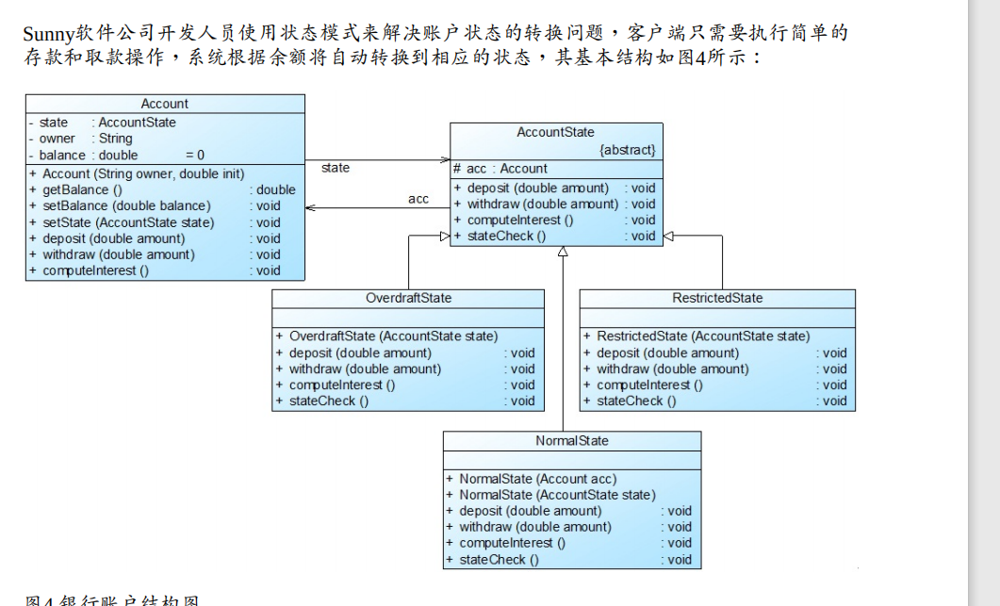

#   状态模式概述

状态模式定义如下： 

状态模式(State Pattern)：允许一个对象在其内部状态改变时改变它的行为，对象看起来似乎修 

改了它的类。其别名为状态对象(Objects for States)，状态模式是一种对象行为型模式。

## 在状态模式结构图中包含如下几个角色： 

● Context（环境类）：环境类又称为上下文类，它是拥有多种状态的对象。由于环境类的状 

态存在多样性且在不同状态下对象的行为有所不同，因此将状态独立出去形成单独的状态 

类。在环境类中维护一个抽象状态类State的实例，这个实例定义当前状态，在具体实现时， 

它是一个State子类的对象。 

● State（抽象状态类）：它用于定义一个接口以封装与环境类的一个特定状态相关的行为，在 

抽象状态类中声明了各种不同状态对应的方法，而在其子类中实现类这些方法，由于不同状 

态下对象的行为可能不同，因此在不同子类中方法的实现可能存在不同，相同的方法可以写 

在抽象状态类中 

● ConcreteState（具体状态类）：它是抽象状态类的子类，每一个子类实现一个与环境类的一 

个状态相关的行为，每一个具体状态类对应环境的一个具体状态，不同的具体状态类其行为 

有所不同。 

# 3 完整解决方案 

## 共享状态 

在有些情况下，多个环境对象可能需要共享同一个状态，如果希望在系统中实现多个环境对 

象共享一个或多个状态对象，那么需要将这些状态对象定义为环境类的静态成员对象。 

 

## 使用环境类实现状态转换 

在状态模式中实现状态转换时，具体状态类可通过调用环境类Context的setState()方法进行状态 

的转换操作，也可以统一由环境类Context来实现状态的转换。此时，增加新的具体状态类可 

能需要修改其他具体状态类或者环境类的源代码，否则系统无法转换到新增状态。但是对于 

客户端来说，无须关心状态类，可以为环境类设置默认的状态类，而将状态的转换工作交给 

具体状态类或环境类来完成，具体的转换细节对于客户端而言是透明的

# 状态模式总结 

状态模式将一个对象在不同状态下的不同行为封装在一个个状态类中，通过设置不同的状态 

对象可以让环境对象拥有不同的行为，而状态转换的细节对于客户端而言是透明的，方便了 

客户端的使用。在实际开发中，状态模式具有较高的使用频率，在工作流和游戏开发中状态 

模式都得到了广泛的应用，例如公文状态的转换、游戏中角色的升级等

###  主要优点 

状态模式的主要优点如下： 

(1) 封装了状态的转换规则，在状态模式中可以将状态的转换代码封装在环境类或者具体状态 

类中，可以对状态转换代码进行集中管理，而不是分散在一个个业务方法中。 

(2) 将所有与某个状态有关的行为放到一个类中，只需要注入一个不同的状态对象即可使环境 

对象拥有不同的行为。 

(3) 允许状态转换逻辑与状态对象合成一体，而不是提供一个巨大的条件语句块，状态模式可 

以让我们避免使用庞大的条件语句来将业务方法和状态转换代码交织在一起。 

(4) 可以让多个环境对象共享一个状态对象，从而减少系统中对象的个数。 

### 主要缺点 

状态模式的主要缺点如下： 

(1) 状态模式的使用必然会增加系统中类和对象的个数，导致系统运行开销增大。 

(2) 状态模式的结构与实现都较为复杂，如果使用不当将导致程序结构和代码的混乱，增加系 

统设计的难度。 

(3) 状态模式对“开闭原则”的支持并不太好，增加新的状态类需要修改那些负责状态转换的源 

代码，否则无法转换到新增状态；而且修改某个状态类的行为也需修改对应类的源代码。 

### 适用场景 

在以下情况下可以考虑使用状态模式： 

(1) 对象的行为依赖于它的状态（如某些属性值），状态的改变将导致行为的变化。 

(2) 在代码中包含大量与对象状态有关的条件语句，这些条件语句的出现，会导致代码的可维 

护性和灵活性变差，不能方便地增加和删除状态，并且导致客户类与类库之间的耦合增强。

# 自己理解
和备忘录模型相像,状态模式是创建多个描述实体类状态的类,然后根据状态类进行决策,备忘录模式是创建一个状态类,然后用这个状态类
保持数据信息,