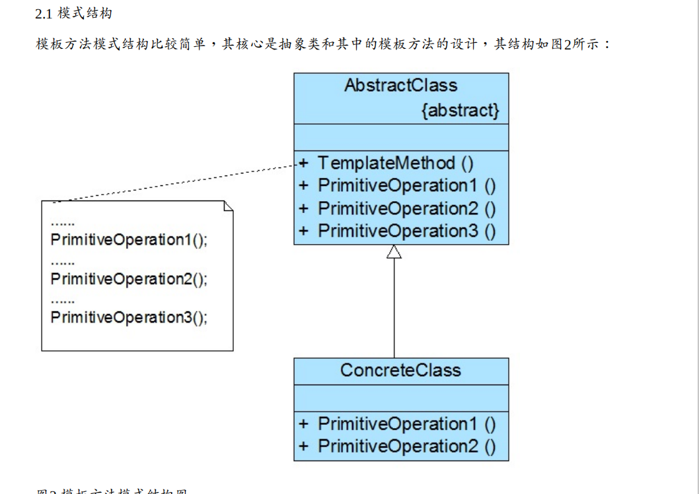
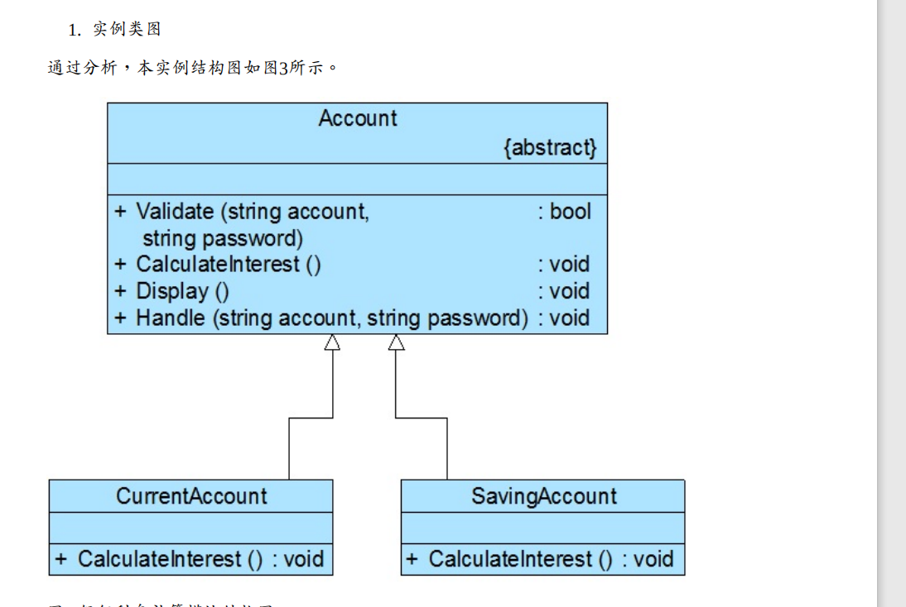

# 模板方法模式

模板方法模式定义如下： 

模板方法模式：定义一个操作中算法的框架，而将一些步骤延迟到子类中。模板方法模 

式使得子类可以不改变一个算法的结构即可重定义该算法的某些特定步骤。

## 模板方法模式包含如下两个角色： 

(1) AbstractClass（抽象类）：在抽象类中定义了一系列基本操作(PrimitiveOperations)，这些基 

本操作可以是具体的，也可以是抽象的，每一个基本操作对应算法的一个步骤，在其子类中 

可以重定义或实现这些步骤。同时，在抽象类中实现了一个模板方法(Template Method)，用于 

定义一个算法的框架，模板方法不仅可以调用在抽象类中实现的基本方法，也可以调用在抽 

象类的子类中实现的基本方法，还可以调用其他对象中的方法。 

(2) ConcreteClass（具体子类）：它是抽象类的子类，用于实现在父类中声明的抽象基本操作 

以完成子类特定算法的步骤，也可以覆盖在父类中已经实现的具体基本操作。 

## 实例

## 钩子方法的使用 

模板方法模式中，在父类中提供了一个定义算法框架的模板方法，还提供了一系列抽象方 

法、具体方法和钩子方法，其中钩子方法的引入使得子类可以控制父类的行为。最简单的钩 

子方法就是空方法，代码如下： 

public virtual void Display() { } 

当然也可以在钩子方法中定义一个默认的实现，如果子类不覆盖钩子方法，则执行父类的默 

认实现代码。 

另一种钩子方法可以实现对其他方法进行约束，这种钩子方法通常返回一个bool类型，即返回 

true或false，用来判断是否执行某一个基本方法

## 5 模板方法模式效果与适用场景 

模板方法模式是基于继承的代码复用技术，它体现了面向对象的诸多重要思想，是一种使用 

较为频繁的模式。模板方法模式广泛应用于框架设计中，以确保通过父类来控制处理流程的 

逻辑顺序（如框架的初始化，测试流程的设置等）。 

#### 5.1 模式优点 

模板方法模式的主要优点如下： 

(1) 在父类中形式化地定义一个算法，而由它的子类来实现细节的处理，在子类实现详细的处

理算法时并不会改变算法中步骤的执行次序。 

(2) 模板方法模式是一种代码复用技术，它在类库设计中尤为重要，它提取了类库中的公共行 

为，将公共行为放在父类中，而通过其子类来实现不同的行为，它鼓励我们恰当使用继承来 

实现代码复用。 

(3) 可实现一种反向控制结构，通过子类覆盖父类的钩子方法来决定某一特定步骤是否需要执 

行。

(4) 在模板方法模式中可以通过子类来覆盖父类的基本方法，不同的子类可以提供基本方法的 

不同实现，更换和增加新的子类很方便，符合单一职责原则和开闭原则。 

### 5.2 模式缺点 

模板方法模式的主要缺点如下： 

需要为每一个基本方法的不同实现提供一个子类，如果父类中可变的基本方法太多，将会导 

致类的个数增加，系统更加庞大，设计也更加抽象，此时，可结合桥接模式来进行设计。 

### 5.3 模式适用场景 

在以下情况下可以考虑使用模板方法模式： 

(1) 对一些复杂的算法进行分割，将其算法中固定不变的部分设计为模板方法和父类具体方 

法，而一些可以改变的细节由其子类来实现。即：一次性实现一个算法的不变部分，并将可 

变的行为留给子类来实现。 

(2) 各子类中公共的行为应被提取出来并集中到一个公共父类中以避免代码重复。 

(3) 需要通过子类来决定父类算法中某个步骤是否执行，实现子类对父类的反向控制。