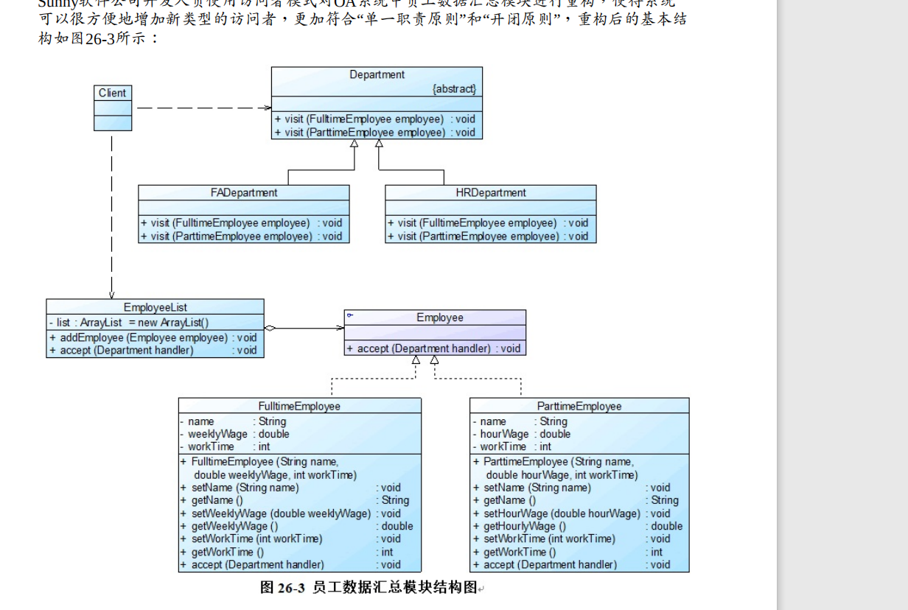

# 访问者模式

访问者模式定义如下： 

访问者模式(Visitor Pattern):提供一个作用于某对象结构中的各元素的操作表示，它使我们可以 

在不改变各元素的类的前提下定义作用于这些元素的新操作。访问者模式是一种对象行为型 

模式

## 在访问者模式结构图中包含如下几个角色： 

●Vistor（抽象访问者）：抽象访问者为对象结构中每一个具体元素类ConcreteElement声明一 

个访问操作，从这个操作的名称或参数类型可以清楚知道需要访问的具体元素的类型，具体 

访问者需要实现这些操作方法，定义对这些元素的访问操作。 

●ConcreteVisitor（具体访问者）：具体访问者实现了每个由抽象访问者声明的操作，每一个操 

作用于访问对象结构中一种类型的元素。 

●Element（抽象元素）：抽象元素一般是抽象类或者接口，它定义一个accept()方法，该方法 

通常以一个抽象访问者作为参数。【稍后将介绍为什么要这样设计。】 

●ConcreteElement（具体元素）：具体元素实现了accept()方法，在accept()方法中调用访问者 

的访问方法以便完成对一个元素的操作。 

● ObjectStructure（对象结构）：对象结构是一个元素的集合，它用于存放元素对象，并且提 

供了遍历其内部元素的方法。它可以结合组合模式来实现，也可以是一个简单的集合对象， 

如一个List对象或一个Set对象。

## 实例 

## 访问者模式总结 

由于访问者模式的使用条件较为苛刻，本身结构也较为复杂，因此在实际应用中使用频率不

是特别高。当系统中存在一个较为复杂的对象结构，且不同访问者对其所采取的操作也不相 

同时，可以考虑使用访问者模式进行设计。在XML文档解析、编译器的设计、复杂集合对象 

的处理等领域访问者模式得到了一定的应用。 

### 1.主要优点 

访问者模式的主要优点如下： 

(1) 增加新的访问操作很方便。使用访问者模式，增加新的访问操作就意味着增加一个新的具 

体访问者类，实现简单，无须修改源代码，符合“开闭原则”。 

(2) 将有关元素对象的访问行为集中到一个访问者对象中，而不是分散在一个个的元素类中。 

类的职责更加清晰，有利于对象结构中元素对象的复用，相同的对象结构可以供多个不同的 

访问者访问。 

(3) 让用户能够在不修改现有元素类层次结构的情况下，定义作用于该层次结构的操作。 

### 2.主要缺点 

访问者模式的主要缺点如下： 

(1) 增加新的元素类很困难。在访问者模式中，每增加一个新的元素类都意味着要在抽象访问 

者角色中增加一个新的抽象操作，并在每一个具体访问者类中增加相应的具体操作，这违背 

了“开闭原则”的要求。 

(2) 破坏封装。访问者模式要求访问者对象访问并调用每一个元素对象的操作，这意味着元素 

对象有时候必须暴露一些自己的内部操作和内部状态，否则无法供访问者访问。 

### 3.适用场景 

在以下情况下可以考虑使用访问者模式： 

(1) 一个对象结构包含多个类型的对象，希望对这些对象实施一些依赖其具体类型的操作。在 

访问者中针对每一种具体的类型都提供了一个访问操作，不同类型的对象可以有不同的访问 

操作。 

(2) 需要对一个对象结构中的对象进行很多不同的并且不相关的操作，而需要避免让这些操 

作“污染”这些对象的类，也不希望在增加新操作时修改这些类。访问者模式使得我们可以将相 

关的访问操作集中起来定义在访问者类中，对象结构可以被多个不同的访问者类所使用，将 

对象本身与对象的访问操作分离。 

(3) 对象结构中对象对应的类很少改变，但经常需要在此对象结构上定义新的操作。