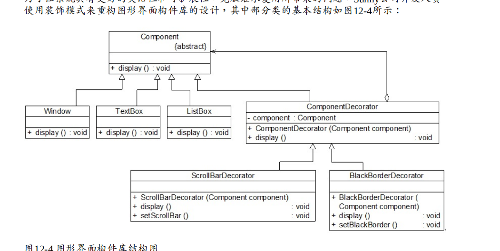
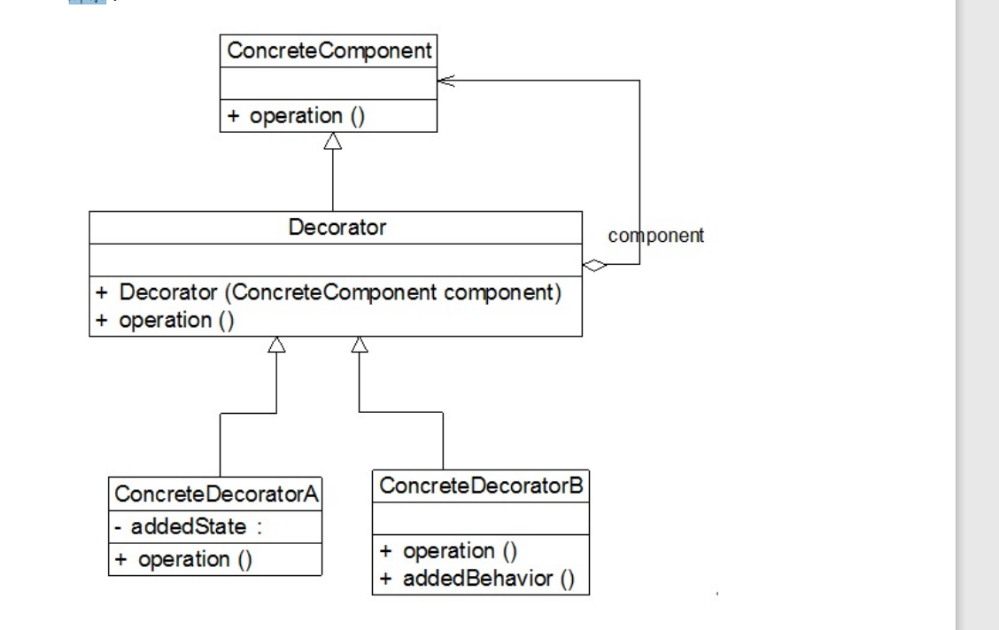

# 装饰模式概述(对现有功能添加)
装饰模式可以在不改变一个对象本身功能的基础上给对象增加额外的新行为，

装饰模式(Decorator Pattern)：动态地给一个对象增加一些额外的职责，就增加对象功能来说， 装饰模式比生成子类实现更为灵活。装饰模式是一种对象结构型模式。

在装饰模式结构图中包含如下几个角色：

● Component（抽象构件）：它是具体构件和抽象装饰类的共同父类，声明了在具体构件中实 现的业务方法，它的引入可以使客户端以一致的方式处理未被装饰的对象以及装饰之后的对 象，实现客户端的透明操作。

● ConcreteComponent（具体构件）：它是抽象构件类的子类，用于定义具体的构件对象，实 现了在抽象构件中声明的方法，装饰器可以给它增加额外的职责（方法）。

● Decorator（抽象装饰类）：它也是抽象构件类的子类，用于给具体构件增加职责，但是具体 职责在其子类中实现。它维护一个指向抽象构件对象的引用，通过该引用可以调用装饰之前 构件对象的方法，并通过其子类扩展该方法，以达到装饰的目的。

● ConcreteDecorator（具体装饰类）：它是抽象装饰类的子类，负责向构件添加新的职责。每 一个具体装饰类都定义了一些新的行为，它可以调用在抽象装饰类中定义的方法，并可以增 加新的方法用以扩充对象的行为。

## 透明装饰模式与半透明装饰模式

### (1)透明装饰模式
在透明装饰模式中，要求客户端完全针对抽象编程，装饰模式的透明性要求客户端程序不应 该将对象声明为具体构件类型或具体装饰类型，而应该全部声明为抽象构件类型。对于客户 端而言，具体构件对象和具体装饰对象没有任何区别。

透明装饰模式可以让客户端透明地使用装饰之前的对象和装饰之后的对象，无须关心它们的 区别，此外，还可以对一个已装饰过的对象进行多次装饰，得到更为复杂、功能更为强大的 对象。在实现透明装饰模式时，要求具体装饰类的operation()方法覆盖抽象装饰类的operation() 方法，除了调用原有对象的operation()外还需要调用新增的addedBehavior()方法来增加新行 为

### (2)半透明装饰模式
透明装饰模式的设计难度较大，而且有时我们需要单独调用新增的业务方法。为了能够调用 到新增方法，我们不得不用具体装饰类型来定义装饰之后的对象，而具体构件类型还是可以 使用抽象构件类型来定义，这种装饰模式即为半透明装饰模式，也就是说，对于客户端而 言，具体构件类型无须关心，是透明的；但是具体装饰类型必须指定，这是不透明的。

### 装饰模式注意事项
(1) 尽量保持装饰类的接口与被装饰类的接口相同，这样，对于客户端而言，无论是装饰之前 的对象还是装饰之后的对象都可以一致对待。这也就是说，在可能的情况下，我们应该尽量 使用透明装饰模式。

(2) 尽量保持具体构件类ConcreteComponent是一个“轻”类，也就是说不要把太多的行为放在具体构件类中，我们可以通过装饰类对其进行扩展。

(3) 如果只有一个具体构件类，那么抽象装饰类可以作为该具体构件类的直接子类。如图所示

## 装饰模式总结

装饰模式降低了系统的耦合度，可以动态增加或删除对象的职责，并使得需要装饰的具体构 件类和具体装饰类可以独立变化，以便增加新的具体构件类和具体装饰类。在软件开发中， 装饰模式应用较为广泛

1.主要优点

(1) 对于扩展一个对象的功能，装饰模式比继承更加灵活性，不会导致类的个数急剧增加。

(2) 可以通过一种动态的方式来扩展一个对象的功能，通过配置文件可以在运行时选择不同的 具体装饰类，从而实现不同的行为。

(3) 可以对一个对象进行多次装饰，通过使用不同的具体装饰类以及这些装饰类的排列组合， 可以创造出很多不同行为的组合，得到功能更为强大的对象。

(4) 具体构件类与具体装饰类可以独立变化，用户可以根据需要增加新的具体构件类和具体装 饰类，原有类库代码无须改变，符合“开闭原则”。

2.主要缺点

(1) 使用装饰模式进行系统设计时将产生很多小对象，这些对象的区别在于它们之间相互连接 的方式有所不同，而不是它们的类或者属性值有所不同，大量小对象的产生势必会占用更多 的系统资源，在一定程序上影响程序的性能。

(2) 装饰模式提供了一种比继承更加灵活机动的解决方案，但同时也意味着比继承更加易于出 错，排错也很困难，对于多次装饰的对象，调试时寻找错误可能需要逐级排查，较为繁琐。

3.适用场景

(1) 在不影响其他对象的情况下，以动态、透明的方式给单个对象添加职责。

(2) 当不能采用继承的方式对系统进行扩展或者采用继承不利于系统扩展和维护时可以使用装 饰模式。不能采用继承的情况主要有两类：第一类是系统中存在大量独立的扩展，为支持每 一种扩展或者扩展之间的组合将产生大量的子类，使得子类数目呈爆炸性增长；第二类是因 为类已定义为不能被继承（如Java语言中的final类）。

