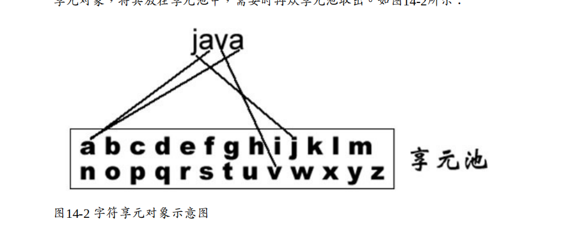
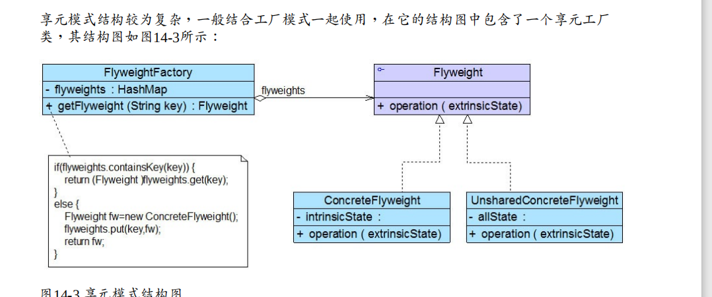
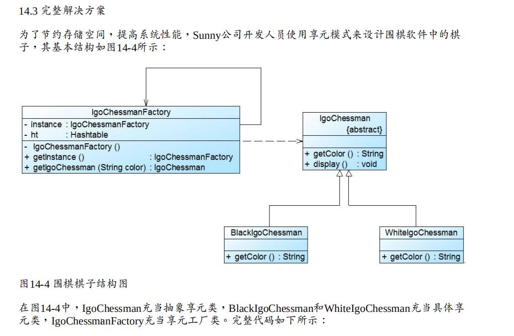
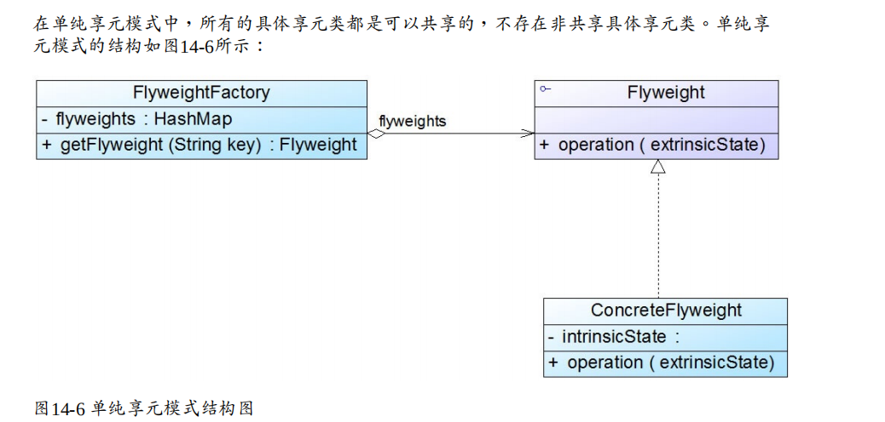
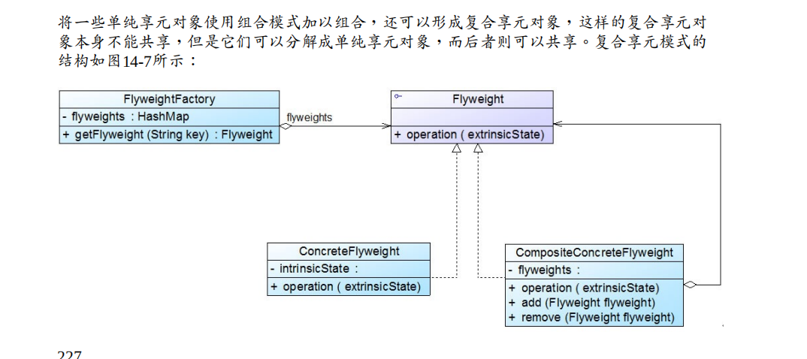

#  享元模式概述 

当一个软件系统在运行时产生的对象数量太多，将导致运行代价过高，带来系统性能下降等 

问题。



享元模式以共享的方式高效地支持大量细粒度对象的重用，享元对象能做到共享的关键是区 

分了内部状态(Intrinsic State)和外部状态(Extrinsic State)。


(1) 内部状态是存储在享元对象内部并且不会随环境改变而改变的状态，内部状态可以共享。 

如字符的内容，不会随外部环境的变化而变化，无论在任何环境下字符“a”始终是“a”，都不会 

变成“b”。 

(2) 外部状态是随环境改变而改变的、不可以共享的状态。享元对象的外部状态通常由客户端 

保存，并在享元对象被创建之后，需要使用的时候再传入到享元对象内部。一个外部状态与 

另一个外部状态之间是相互独立的。如字符的颜色，可以在不同的地方有不同的颜色，例如 

有的“a”是红色的，有的“a”是绿色的，字符的大小也是如此，有的“a”是五号字，有的“a”是四 

号字。而且字符的颜色和大小是两个独立的外部状态，它们可以独立变化，相互之间没有影 

响，客户端可以在使用时将外部状态注入享元对象中。


## 享元模式定义如下： 

享元模式(Flyweight Pattern)：运用共享技术有效地支持大量细粒度对象的复用。系统只使 用少量的对象，而这些对象都很相似，状态变化很小，可以实现对象的多次复用。由于 享元模式要求能够共享的对象必须是细粒度对象，因此它又称为轻量级模式，它是一种 对象结构型模式。




在享元模式结构图中包含如下几个角色： 

● Flyweight（抽象享元类）：通常是一个接口或抽象类，在抽象享元类中声明了具体享元类公 

共的方法，这些方法可以向外界提供享元对象的内部数据（内部状态），同时也可以通过这 

些方法来设置外部数据（外部状态）。 

● ConcreteFlyweight（具体享元类）：它实现了抽象享元类，其实例称为享元对象；在具体享 

元类中为内部状态提供了存储空间。通常我们可以结合单例模式来设计具体享元类，为每一 

个具体享元类提供唯一的享元对象。 

● UnsharedConcreteFlyweight（非共享具体享元类）：并不是所有的抽象享元类的子类都需要 

被共享，不能被共享的子类可设计为非共享具体享元类；当需要一个非共享具体享元类的对 

象时可以直接通过实例化创建。 

● FlyweightFactory（享元工厂类）：享元工厂类用于创建并管理享元对象，它针对抽象享元 

类编程，将各种类型的具体享元对象存储在一个享元池中，享元池一般设计为一个存储“键值 

对”的集合（也可以是其他类型的集合），可以结合工厂模式进行设计；当用户请求一个具体 

享元对象时，享元工厂提供一个存储在享元池中已创建的实例或者创建一个新的实例（如果 

不存在的话），返回新创建的实例并将其存储在享元池中。 


## 例子结构




# 单纯享元模式和复合享元模式 

## 1.单纯享元模式 




## 2.复合享元模式




 

# 关于享元模式的几点补充

##  1.与其他模式的联用 

(1)在享元模式的享元工厂类中通常提供一个静态的工厂方法用于返回享元对象，使用简单工 

厂模式来生成享元对象。 

(2)在一个系统中，通常只有唯一一个享元工厂，因此可以使用单例模式进行享元工厂类的设 

计。

(3)享元模式可以结合组合模式形成复合享元模式，统一对多个享元对象设置外部状态。 

## 2.享元模式与String类 

JDK类库中的String类使用了享元模式，我们通过如下代码来加以说明： 

``` java
class Demo { public static void main(String args[]) { 

String str1 = "abcd"; 

String str2 = "abcd"; 

String str3 = "ab" + "cd"; 

String str4 = "ab"; 

str4 += "cd"; 

System.out.println(str1 == str2); 

System.out.println(str1 == str3); 

System.out.println(str1 == str4); 

str2 += "e"; 

System.out.println(str1 == str2); 

} 

}
true 

true 

false 

false
```

扩展

关于Java String类这种在修改享元对象时，先将原有对象复制一份，然后在新对象上再实 

施修改操作的机制称为“Copy On Write”，


# 享元模式总结

当系统中存在大量相同或者相似的对象时，享元模式是一种较好的解决方案，它通过共享技 

术实现相同或相似的细粒度对象的复用，从而节约了内存空间，提高了系统性能。相比其他 

结构型设计模式，享元模式的使用频率并不算太高，但是作为一种以“节约内存，提高性能”为 

出发点的设计模式，它在软件开发中还是得到了一定程度的应用。 

## 1.主要优点

(1) 可以极大减少内存中对象的数量，使得相同或相似对象在内存中只保存一份，从而可以节 

约系统资源，提高系统性能。 

(2) 享元模式的外部状态相对独立，而且不会影响其内部状态，从而使得享元对象可以在不同 

的环境中被共享

## 2.主要缺点 

(1) 享元模式使得系统变得复杂，需要分离出内部状态和外部状态，这使得程序的逻辑复杂 

化。

(2) 为了使对象可以共享，享元模式需要将享元对象的部分状态外部化，而读取外部状态将使 

得运行时间变长。 

## 3.适用场景

(1) 一个系统有大量相同或者相似的对象，造成内存的大量耗费。 

(2) 对象的大部分状态都可以外部化，可以将这些外部状态传入对象中。 

(3) 在使用享元模式时需要维护一个存储享元对象的享元池，而这需要耗费一定的系统资源， 

因此，应当在需要多次重复使用享元对象时才值得使用享元模式。 