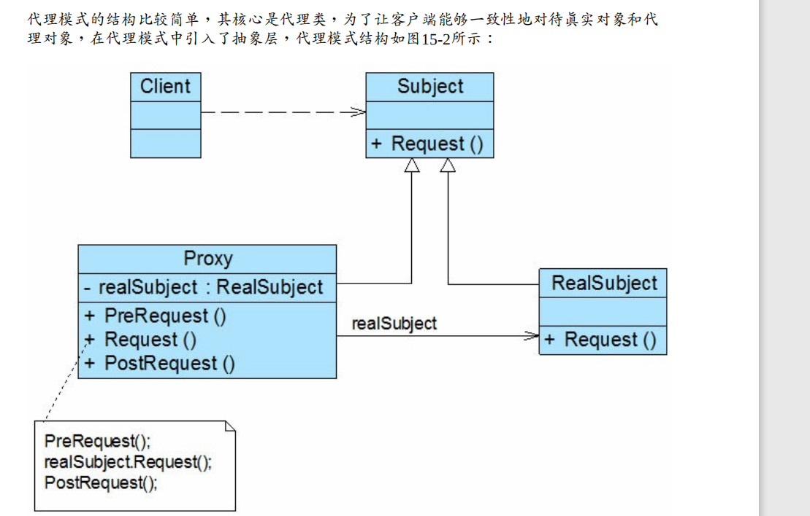

# 代理模式概述

代理模式：给某一个对象提供一个代理或占位符，并由代理对象来控制对原对象的访问。 

代理模式是一种对象结构型模式。在代理模式中引入了一个新的代理对象，代理对象在客户 

端对象和目标对象之间起到中介的作用，它去掉客户不能看到的内容和服务或者增添客户需 

要的额外的新服务。 

模式结构

##　三个角色

(1) Subject（抽象主题角色）：它声明了真实主题和代理主题的共同接口，这样一来在任何使 

用真实主题的地方都可以使用代理主题，客户端通常需要针对抽象主题角色进行编程。 

(2) Proxy（代理主题角色）：它包含了对真实主题的引用，从而可以在任何时候操作真实主题 

对象；在代理主题角色中提供一个与真实主题角色相同的接口，以便在任何时候都可以替代 

真实主题；代理主题角色还可以控制对真实主题的使用，负责在需要的时候创建和删除真实 

主题对象，并对真实主题对象的使用加以约束。通常，在代理主题角色中，客户端在调用所 

引用的真实主题操作之前或之后还需要执行其他操作，而不仅仅是单纯调用真实主题对象中 

的操作。 

(3) RealSubject（真实主题角色）：它定义了代理角色所代表的真实对象，在真实主题角色中 

实现了真实的业务操作，客户端可以通过代理主题角色间接调用真实主题角色中定义的操 

作

### 常用的几种代理场景

(1) 远程代理(Remote Proxy)：为一个位于不同的地址空间的对象提供一个本地的代理对象，这 

个不同的地址空间可以是在同一台主机中，也可是在另一台主机中，远程代理又称为大使 

(Ambassador)。 

(2) 虚拟代理(Virtual Proxy)：如果需要创建一个资源消耗较大的对象，先创建一个消耗相对较 

小的对象来表示，真实对象只在需要时才会被真正创建。 

(3) 保护代理(Protect Proxy)：控制对一个对象的访问，可以给不同的用户提供不同级别的使用 权限。 

(4) 缓冲代理(Cache Proxy)：为某一个目标操作的结果提供临时的存储空间，以便多个客户端 

可以共享这些结果。 

(5) 智能引用代理(Smart Reference Proxy)：当一个对象被引用时，提供一些额外的操作，例如 

将对象被调用的次数记录下来等

## 实例

自己需要测试

# 总结

## 优点

(1) 能够协调调用者和被调用者，在一定程度上降低了系统的耦合度。 

(2) 客户端可以针对抽象主题角色进行编程，增加和更换代理类无须修改源代码，符合开闭原 

则，系统具有较好的灵活性和可扩展性。 

此外，不同类型的代理模式也具有独特的优点，例如：

(1) 远程代理为位于两个不同地址空间对象的访问提供了一种实现机制，可以将一些消耗资源 

较多的对象和操作移至性能更好的计算机上，提高系统的整体运行效率。 

(2) 虚拟代理通过一个消耗资源较少的对象来代表一个消耗资源较多的对象，可以在一定程度 

上节省系统的运行开销。 

(3) 缓冲代理为某一个操作的结果提供临时的缓存存储空间，以便在后续使用中能够共享这些 

结果，优化系统性能，缩短执行时间。 

(4) 保护代理可以控制对一个对象的访问权限，为不同用户提供不同级别的使用权限。 